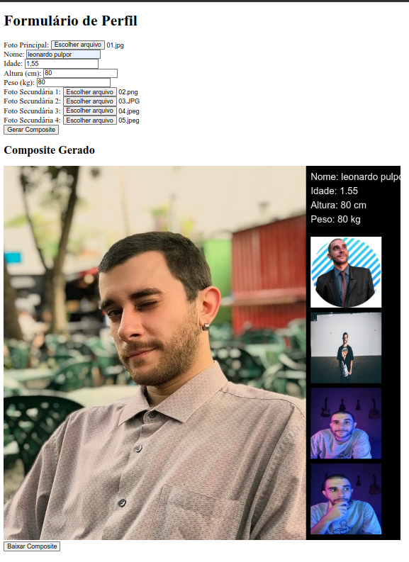

# Gerador de Composite - Agência de Modelos

Neste desafio, a tarefa é implementar um botão chamado "Gerar Composite" que permitirá aos usuários criar um composto visual contendo a foto principal de um modelo e as informações inseridas em um formulário. O composto final será uma imagem que pode ser baixada e exibirá as informações do modelo juntamente com fotos secundárias.

## Instruções

1. Clone ou faça o download deste repositório para obter os arquivos necessários.

2. Abra o arquivo `index.html` em um navegador da web para visualizar o formulário.

3. Preencha o formulário com os dados solicitados, incluindo a foto principal do modelo e outras informações relevantes.

4. Clique no botão "Gerar Composite" para iniciar o processo de criação do composto.

5. Aguarde até que o composto seja gerado. Isso envolve combinar as imagens, informações do modelo e fotos secundárias em um único composto visual.

6. Após a geração, você verá o composite resultante exibido na página.

7. Um link de download será fornecido para baixar o composto em formato de imagem.

## Detalhes da Implementação

- A imagem principal do modelo é carregada a partir do arquivo selecionado.
- Dados como nome, idade, altura e peso são extraídos do formulário e adicionados ao composto.
- Até quatro fotos secundárias podem ser adicionadas, e cada uma é exibida ao lado das informações do modelo no composto.
- O composite final é exibido na página e um botão de download é fornecido para baixar o composto.

## Tecnologias Utilizadas

- HTML
- JavaScript

## Como Iniciar

1. Clone este repositório usando o comando: `git clone https://github.com/seu-usuario/seu-repositorio.git`.

2. Navegue até o diretório do projeto: `cd seu-repositorio`.

3. Abra o arquivo `index.html` em um navegador para testar a funcionalidade.

4. Personalize o código conforme necessário para atender aos requisitos do desafio.

## Notas

- Certifique-se de que as imagens estão sendo carregadas corretamente e que você possui as permissões apropriadas para manipulá-las.
- Verifique o console do navegador para quaisquer mensagens de erro que possam ajudar a identificar problemas durante a execução.

## Autor

Leonardo Pulpor

pulppor@gmail.com
